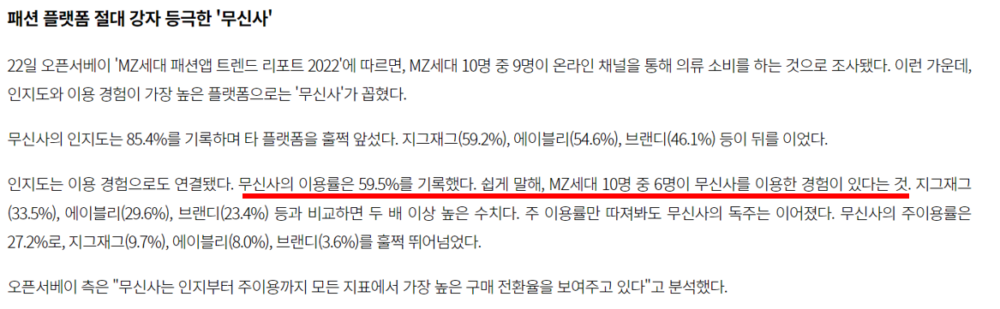
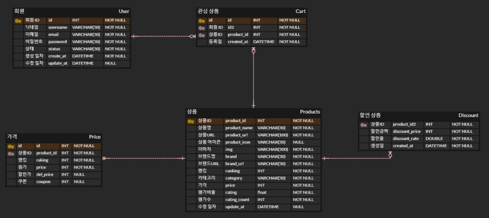

## 🌐MUSINSA-MONITOR

-----
무신사 인기 상품 모니터링 프로젝트

## 🧐 기획 배경

-----

- 59.9% 이용률, MZ 세대 10명 중 6명이 사용하는 인기 패션 온라인 쇼핑몰 “무신사”의 인기 상품 가격 정보를 모니터링하여 효율적인 구매 시기를 정하는데 도움이 되고자 기획하였습니다.

## 📝기획 목적

----

무신사 사이트에서 대량의 데이터를 크롤링해보는 작업과 대량의 데이터 조회시 캐시를 통한 응답 속도를 향상, 
대용량 데이터의의 Spring Batch를 통한 운영의 효율성을 위한 학습이 목표입니다.

## 💻개발 환경

--------
1. **개발**

    - Spring Boot
    
    - Spring Security

    - JSON Web Token

2. **테스트**

    - JUnit5
    - Mockito

3. **데이터베이스**

    - MySQL
    - JPA
    - Querydsl

4. **빌드관리**

    - Gradle

5. **형상관리**

    - Git

    - Github

## 📌프로젝트 기능

--------

회원

- **이메일 로그인**
- **관심 상품 등록, 조회, 삭제**
- **상품 정보 조회**
    - 가격 변동 통계

관리자

- **상품 정보 설정**
  - 상품 정보 저장
  - 상품 정보 삭제

누구나

- 일간 랭킹 조회
- 상품 조회
- 브랜드 조회
- 품목 별 조회
- 가격 범위 필터링 조회

일정 주기마다 자동 실행

- 금일 인기 상품 정보 업데이트
    - Spring Scheduler 이용하여 매일 무신사 인기 상품 정보 Crawling을 통해 DB에 저장

## 📁 ERD

--------
